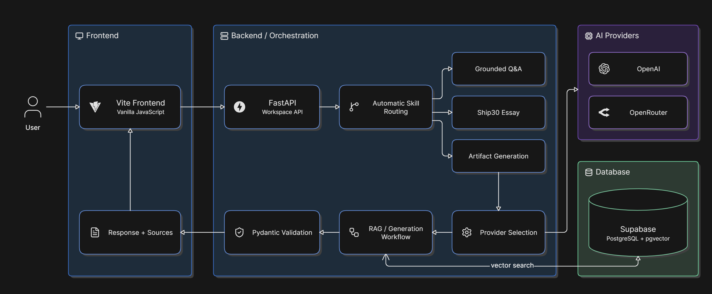

# Lenny Growth Assistant

The **Lenny Growth Assistant** is a full-stack AI-powered conversational application built around transcripts from **Lenny’s Podcast**. It helps users ask grounded product and growth questions, generate Ship30-style essays, and create lightweight artifacts such as Markdown documents and HTML previews.

## Features

- Grounded Q&A using Lenny’s Podcast transcripts
- OpenAI and OpenRouter provider support
- Automatic routing between Q&A, essay, and artifact generation
- Source-backed responses using RAG
- Ship30-style essay generation
- Lightweight artifact preview for Markdown, HTML, code, and text

## Tech Stack

### Backend

- Python
- FastAPI
- Pydantic
- SQLAlchemy
- asyncpg
- Alembic
- pgvector
- HTTPX

### AI / RAG

- OpenAI
- OpenRouter
- OpenAI embeddings
- BGE-M3 embeddings
- Retrieval-Augmented Generation
- Hybrid semantic + keyword search
- Reranking
- Pydantic output validation

### Database

- Supabase
- PostgreSQL
- pgvector

### Frontend

- Vite
- Vanilla JavaScript
- HTML / CSS
- Marked
- DOMPurify
- Highlight.js
- Lucide

### Deployment

- Docker
- Railway

## Architecture

The application uses a single end-to-end architecture where the frontend sends user requests to the FastAPI workspace API.The backend automatically selects the appropriate skill, routes the request through the selected AI provider and RAG workflow, validates the response with Pydantic, and returns the final answer with sources.

<p align="center">
  
</p>

## Run Locally

### 1. Clone the repository

```bash
git clone https://github.com/Krithik18/Lenny-Growth-Assistant.git
cd Lenny-Growth-Assistant
```

### 2. Set up the backend

```bash
cd backend
python -m venv .venv
```

#### Windows

```powershell
.\.venv\Scripts\Activate.ps1
```

#### macOS / Linux

```bash
source .venv/bin/activate
```

Install backend dependencies:

```bash
pip install -e .
```

For development and testing:

```bash
pip install -e ".[dev]"
```

### 3. Configure environment variables

Copy the example environment file.

#### Windows

```powershell
Copy-Item .env.example .env
```

#### macOS / Linux

```bash
cp .env.example .env
```

Add your own values:

```env
APP_ENV=development
DATABASE_URL=your_postgresql_connection_string
OPENAI_API_KEY=your_openai_api_key
OPENROUTER_API_KEY=your_openrouter_api_key
```

> Do not commit your `.env` file or API keys.

### 4. Start the backend

From the `backend` directory:

```bash
uvicorn app.main:app --host 127.0.0.1 --port 8000 --reload
```

On Windows:

```powershell
.\.venv\Scripts\python.exe -m uvicorn app.main:app --host 127.0.0.1 --port 8000 --reload
```

Backend URL:

```text
http://127.0.0.1:8000
```

### 5. Set up the frontend

Open another terminal from the project root:

```bash
cd frontend
npm ci
```

Start the development server:

```bash
npm run dev
```

Frontend URL:

```text
http://127.0.0.1:5173
```

### 6. Run tests

#### Backend

```bash
cd backend
python -m pytest
```

#### Frontend build check

```bash
cd frontend
npm run build
```

## Production Deployment

The project includes a root-level `Dockerfile` and can be deployed directly to Railway.

Required Railway environment variables:

```text
DATABASE_URL
OPENAI_API_KEY
OPENROUTER_API_KEY
APP_ENV=production
```

Railway builds the Vite frontend, installs the FastAPI backend, and serves the complete application from a single public URL.

Podcast Transcript Setup

This project uses the public Lenny’s Podcast Transcripts repository as the knowledge source.

Transcript repository:

https://github.com/ChatPRD/lennys-podcast-transcripts

Steps

1. Clone the transcript repository:

git clone https://github.com/ChatPRD/lennys-podcast-transcripts.git

2. Create a ZIP file from the cloned transcript repository.
3. Place the ZIP file at the path expected by:

backend/app/ingestion/source.py

4. Activate the backend virtual environment and run the ingestion pipeline:

python -m app.ingestion

The ingestion pipeline will:

* Read the podcast transcripts
* Parse the transcript files
* Split the transcripts into smaller chunks
* Generate embeddings
* Store the chunks and embeddings in PostgreSQL with pgvector

Once ingestion is complete, the application can use the stored transcript data for retrieval and grounded answer generation.

## Security

- API keys are stored only in backend environment variables
- Secrets are not committed to the repository
- Lower-level raw RAG endpoints remain protected in production

## Limitations

- The assistant is limited to the supplied Lenny’s Podcast knowledge base
- Retrieval may miss relevant passages for very broad or ambiguous questions
- Different model providers can produce slightly different answers
- Multi-stage RAG can have higher latency than a single LLM call
